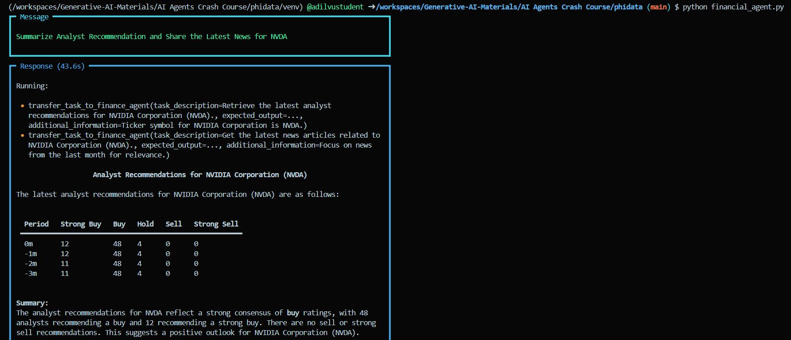

# **Finantial AI Agent Using Phidata**

1. Create a `.env` file and add the **API KEYS** it which will look like this
    ```bash
    PHIDATA_API_KEY="phi-svV90XBS"
    GROQ_API_KEY="gsk_FNEdIAHPgov"
    ```

    -  For Creating API Keys visit following platforms
    
       1. Pihdata (https://www.phidata.app/) 

       2. Groq (https://console.groq.com/login)
 

2. Create a `requirements.txt` file
    - Add the following libraries in thi file:
        ```bash
        python-dotenv
        yfinance
        packaging
        duckduckgo-search
        fastapi
        uvicorn
        openai
        groq
        ```


3. **Create a Conda Environment**
    
    - Create a Conda Environment
        ```bash
        conda create -p venv python=3.11 -y
        ```

    - Activate this Conda Environment
        ```bash
        conda activate venv\
        ```   
    - Install the libraries in `requirements.txt` file using this command:

        ```bash
        pip install -r requirements.txt
        ``` 

4. Now create a file `fianacial_agent.py` and write this code in it

    ```bash
    # Import necessary libraries
    from phi.agent import Agent
    from phi.model.groq import Groq
    from phi.tools.yfinance import YFinanceTools
    from phi.tools.duckduckgo import DuckDuckGo
    from dotenv import load_dotenv
    import os  # Import os to access environment variables

    # Load environment variables from a .env file
    load_dotenv()

    # Set the GROQ_API_KEY from the environment variable
    GROQ_API_KEY = os.getenv('GROQ_API_KEY')
    if not GROQ_API_KEY:
        raise ValueError("GROQ_API_KEY not set in environment variables.")

    # Create agents

    # 1. Create a web search agent
    web_search_agent = Agent(
        name="Web Search Agent",
        role="Search web for the required information",
        model=Groq(id="llama-3.3-70b-versatile", api_key=GROQ_API_KEY),  # Pass the API key to the model
        tools=[DuckDuckGo()],
        instructions=['Always include sources of information'],
        show_tool_calls=True,
        markdown=True,
    )

    # 2. Create a financial stock agent
    finance_agent = Agent(
        name="Finance Agent",
        model=Groq(id="llama-3.3-70b-versatile", api_key=GROQ_API_KEY),  # Pass the API key to the model
        tools=[
            YFinanceTools(stock_price=True, 
                        analyst_recommendations=True,
                        stock_fundamentals=True, 
                        company_info=True, 
                        company_news=True)
        ],
        instructions=['Hey, Use Tables to Display the Data beautifully.'],
        show_tool_calls=True,
        markdown=True,               
    )

    # Combine both agents to make a new agent
    mr_finance_agent = Agent(
        team=[web_search_agent, finance_agent],
        instructions=['Hey, Always include sources of information. Use Tables to Display the Data effectively.'],
        show_tool_calls=True,
        markdown=True,
    )

    # Initiate 'mr_finance_agent' and print the response
    mr_finance_agent.print_response("Summarize Analyst Recommendation and Share the Latest News for NVDA", stream=True)
    ```

    - This will display Result in terminal which will look like this
      
    

    

5. As this result looks quite rough, we want our output to be displayed in a proper playground, for this we will create another file `financial_agent_playground.py`, that will display results in Phidata Playground. We will write this code in this file.

    ```bash
    # Import necessary libraries
    import phi
    import phi.api
    from phi.agent import Agent
    from phi.model.groq import Groq
    from phi.tools.yfinance import YFinanceTools
    from phi.tools.duckduckgo import DuckDuckGo
    from phi.playground import Playground, serve_playground_app
    from dotenv import load_dotenv
    import os  # Import os to access environment variables

    # Load environment variables from a .env file
    load_dotenv()

    # Set the GROQ_API_KEY from the environment variable
    GROQ_API_KEY = os.getenv('GROQ_API_KEY')
    if not GROQ_API_KEY:
        raise ValueError("GROQ_API_KEY not set in environment variables.")

    # Set the PHIDATA_API_KEY from the environment variable
    PHIDATA_API_KEY = os.getenv('PHIDATA_API_KEY')
    if not PHIDATA_API_KEY:
        raise ValueError("PHIDATA_API_KEY not set in environment variables.")  # Fixed error message

    # Create agents

    # 1. Create a web search agent
    web_search_agent = Agent(
        name="Web Search Agent",
        role="Search web for the required information",
        model=Groq(id="llama-3.3-70b-versatile", api_key=GROQ_API_KEY),  # Pass the GROQ API key to the model
        tools=[DuckDuckGo()],
        instructions=['Always include sources of information'],  # Instructions for the agent
        show_tool_calls=True,  # Show tool calls in the output
        markdown=True,  # Use Markdown for formatting
    )

    # 2. Create a financial stock agent
    finance_agent = Agent(
        name="Finance Agent",
        model=Groq(id="llama-3.3-70b-versatile", api_key=GROQ_API_KEY),  # Pass the GROQ API key to the model
        tools=[
            YFinanceTools(
                stock_price=True, 
                analyst_recommendations=True,
                stock_fundamentals=True, 
                company_info=True, 
                company_news=True
            )
        ],
        instructions=['Hey, Use Tables to Display the Data beautifully.'],  # Instructions for the agent
        show_tool_calls=True,  # Show tool calls in the output
        markdown=True,  # Use Markdown for formatting
    )

    # Create a Playground app with the defined agents
    app = Playground(agents=[finance_agent, web_search_agent]).get_app()

    # Main entry point for the application
    if __name__ == "__main__":
        # Serve the Playground app
        serve_playground_app("financial_agent_playground:app", reload=True)
    ```
  
   - Now we need to run this file. In terminal type this command:
       ```bash
       python financial_agent_playground.py
       ```  


    - Your terminal will look like this
         

    - Now in order to access the application You need to go to https://www.phidata.app/playground/chat and `SELECT AN ENDPOPINT` if localhost:7777 is selected by default it's okay, othervise select it:
    

    - This is how communication in Playground will look like:
  
        

That's it Enjoy Your Financial Agent.

-----------