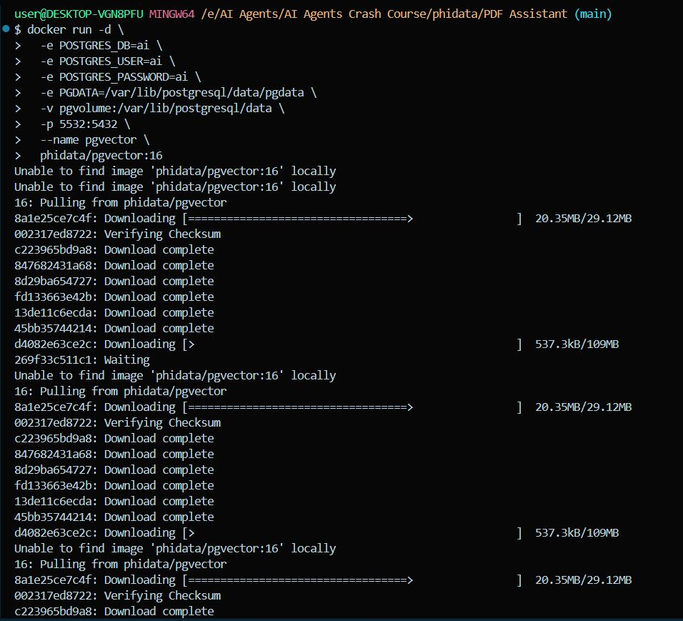

----

# **PgVector Agent Knowledge**

- To setup knowledgebase use these commands in gitbash:
 
    ```bash
    docker run -d \
    -e POSTGRES_DB=ai \
    -e POSTGRES_USER=ai \
    -e POSTGRES_PASSWORD=ai \
    -e PGDATA=/var/lib/postgresql/data/pgdata \
    -v pgvolume:/var/lib/postgresql/data \
    -p 5532:5432 \
    --name pgvector \
    phidata/pgvector:16
    ```

    

- Write this code in `pdf_assistant.py`
    ```bash
    # import libraries
    import typer
    from typing import List, Optional
    from phi.assistant import Assistant
    from phi.vectordb.pgvector import PgVector2
    from phi.knowledge.pdf import PDFUrlKnowledgeBase
    from phi.storage.assistant.postgres import PgAssistantStorage


    from dotenv import load_dotenv

    import os  # Import os to access environment variables

    # Load environment variables from a .env file
    load_dotenv()

    # Set the GROQ_API_KEY from the environment variable
    GROQ_API_KEY = os.getenv('GROQ_API_KEY')
    if not GROQ_API_KEY:
        raise ValueError("GROQ_API_KEY not set in environment variables.")

    # Set the PHIDATA_API_KEY from the environment variable
    PHIDATA_API_KEY = os.getenv('PHIDATA_API_KEY')
    if not PHIDATA_API_KEY:
        raise ValueError("PHIDATA_API_KEY not set in environment variables.")  # Fixed error message

    db_url = "postgresql+psycopg://ai:ai@localhost:5532/ai"

    knowledge_base = PDFUrlKnowledgeBase(
        urls = ["https://phi-public.s3.amazonaws.com/recipes/ThaiRecipes.pdf"],
        vector_db = PgVector2(collection='recipes',db_url=db_url),
    )

    knowledge_base.load()

    storage = PgAssistantStorage(table_name = 'pdf_assistant',db_url=db_url)

    def pdf_assistant(new: bool = False, user: str = "user"):
        run_id: Optional[str] = None

        if not new:
            existing_run_ids: List[str] = storage.get_all_run_ids(user)
            if len(existing_run_ids) > 0:
                run_id = existing_run_ids[0]

        assistant = Assistant(
            run_id=run_id,
            user_id=user,
            knowledge_base=knowledge_base,
            storage=storage,
            # Show tool calls in the response
            show_tool_calls=True,
            # Enable the assistant to search the knowledge base
            search_knowledge=True,
            # Enable the assistant to read the chat history
            read_chat_history=True,
        )
        if run_id is None:
            run_id = assistant.run_id
            print(f"Started Run: {run_id}\n")
        else:
            print(f"Continuing Run: {run_id}\n")

        assistant.cli_app(markdown=True)

    if __name__=="__main__":
        typer.run(pdf_assistant)
    ```
- Run the application
    ```bash
    python pdf_assistant.py
    ```

    
-----